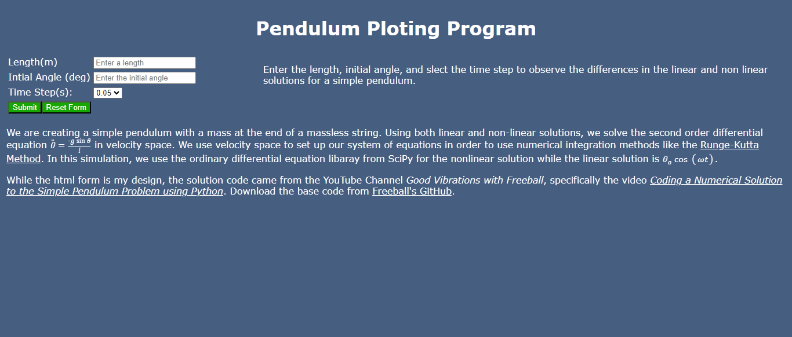

# Pendulum Solutions

Pendulum Solutions is a respository of two differing solutions to the simple pendulum model.  This repsitory is a python Flask frontend with an imbedded plotly.go figure object to simulate the solutions.  Thw simulation is an adaptation of the code from @apf99 repository [af99/Simple-Pendulum-Model](https://github.com/apf99/Simple-Pendulum-Model).  My compliments to he who brought me into python programming.

The code makes use of the matplotlib, plotly, sciPy, and numPy libraries.  You will have to pip install or coda install if you do not have these in your virtual environments. You will alse be using the BytesIO and base64 from os in the code. 

The package has been deployed on go Daddy cPanel at [Pendulum Plot](https://app.lifespectralsurvey.com/plotapp). You need to run the requirements.txt in pip intaller on the SetUp Python Apps Tool on cPanel under Python 3.9.18 version. Otherwise you will get an error on pyproject.toml loader if you deploy on this hosting.  The versions of the packages are from 2018 before the package loader fork. 

